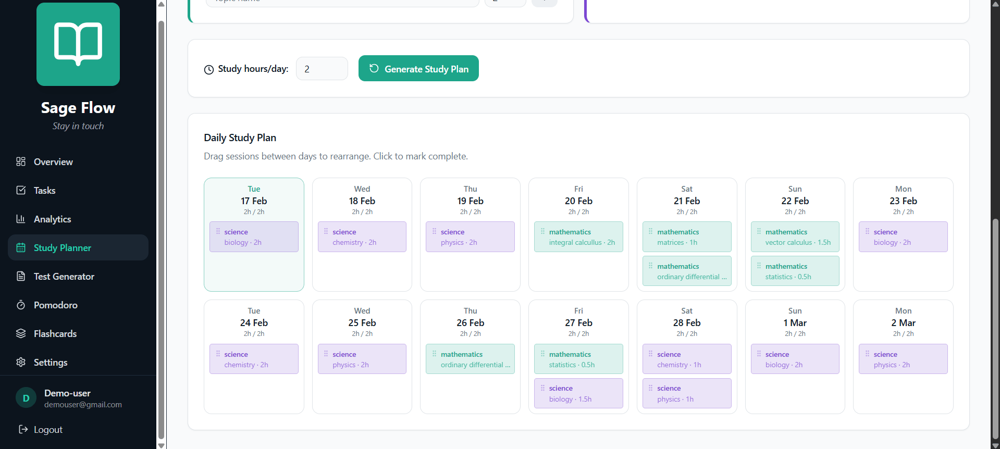
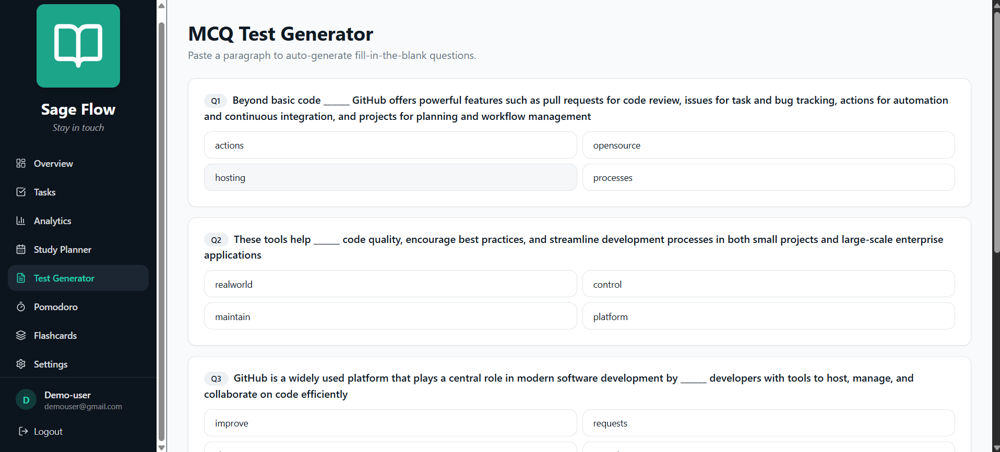

# Sage Flow - Smart Study Companion

**Stay in touch with your studies**

A comprehensive study management application built with React, TypeScript, and Tailwind CSS. Sage Flow helps students organize tasks, plan study schedules, generate tests, and track progress.

## 📸 Screenshots

### Dashboard Overview

### Task Management

### Study Planner

### Test Generator

# Features

### Task Management
- Create, complete, and delete tasks
- Set priorities (Low, Medium, High)
- Set due dates
- Track completion status

### Study Planner
- Create subjects with exam dates
- Add topics with estimated study hours
- Auto-generate study schedules
- Drag-and-drop sessions between days
- Reschedule missed sessions
- Print study schedule

### Test Generator
- Generate MCQ tests from any text
- Fill-in-the-blank questions
- Instant scoring and feedback
- Track test history

### Pomodoro Timer
- Customizable work/break intervals
- Auto-start next session
- Session tracking
- Audio notifications

### Flashcards
- Create custom flashcard decks
- Flip cards to reveal answers
- Perfect for memorization

### Analytics Dashboard
- Task completion statistics
- Study hours by subject
- Test score tracking
- Visual charts and graphs

### Settings
- Edit profile information
- Change password
- Dark mode toggle
- Export/Import data backup
- Delete account

##  Tech Stack

- **Frontend:** React 18 with TypeScript
- **Styling:** Tailwind CSS
- **UI Components:** shadcn/ui (Radix UI)
- **Routing:** React Router v6
- **Charts:** Recharts
- **Icons:** Lucide React
- **Build Tool:** Vite
- **State Management:** React Context API
- **Data Persistence:** LocalStorage

## ⚠️ Important Notes

### Data Storage
- **Local Storage Only**: All data is stored in your browser's LocalStorage
- **Device-Specific**: Your account and data exist only on the device where you created it
- **No Cloud Sync**: Data is not synced across devices or browsers

### Using on Multiple Devices
To use your data on another device:
1. On Device 1: Go to Settings → Export All Data
2. Save the JSON backup file
3. On Device 2: Create a new account with the same credentials
4. Go to Settings → Import Data → Upload your backup file
5. Your data will be restored!

### Data Backup
- **Recommended**: Regularly export your data from Settings
- **Before Clearing Browser**: Always export data before clearing browser cache/data
- **Switching Browsers**: Export from old browser, import to new browser

## 🔒 Security Note

This is a client-side application using LocalStorage for data persistence. For production use with sensitive data, consider implementing:
- Backend API with proper authentication
- Encrypted data storage
- Secure password hashing (currently plain text for demo purposes)
- HTTPS connection
- Cloud database for cross-device sync

