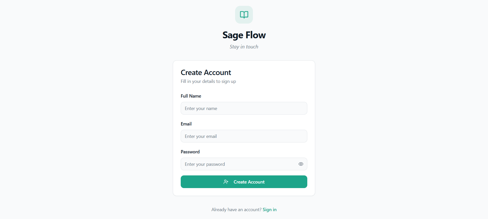
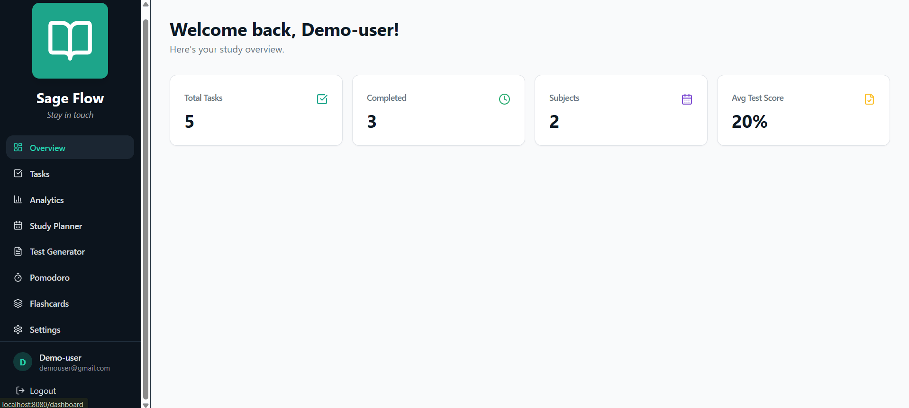
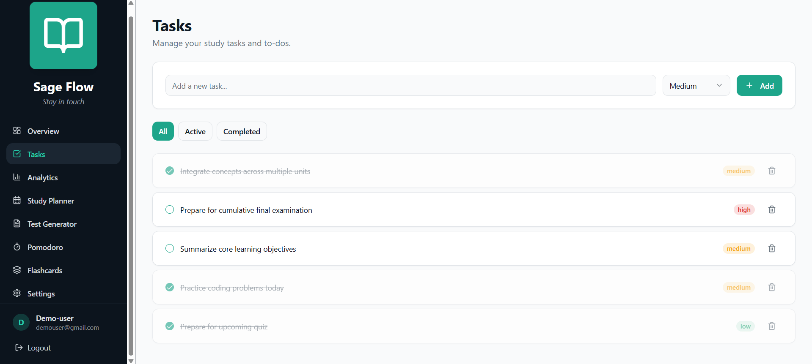
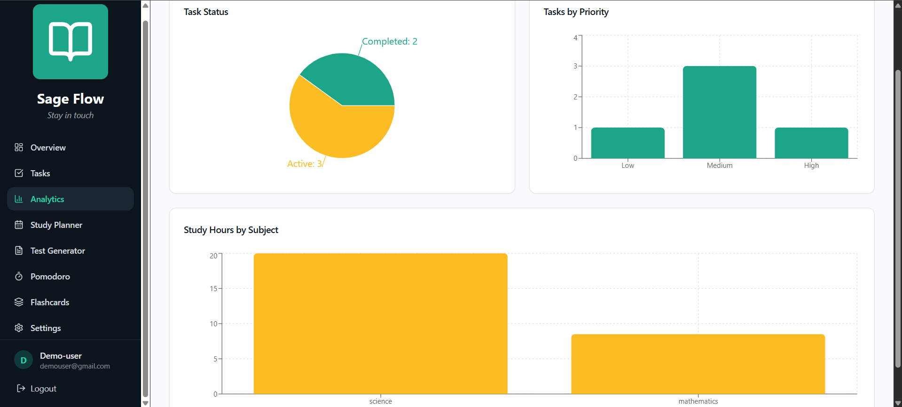

# Sage Flow - Smart Study Companion

**Stay in touch with your studies**

A comprehensive study management application built with React, TypeScript, and Tailwind CSS. Sage Flow helps students organize tasks, plan study schedules, generate tests, and track progress.

## 📸 Screenshots

### Login Page

### Dashboard Overview

## Features

### Task Management
- Create, complete, and delete tasks
- Set priorities (Low, Medium, High)
- Set due dates
- Track completion status

### Study Planner
- Create subjects with exam dates
- Add topics with estimated study hours
- Auto-generate study schedules
- Drag-and-drop sessions between days
- Reschedule missed sessions
- Print study schedule

### Test Generator
- Generate MCQ tests from any text
- Fill-in-the-blank questions
- Instant scoring and feedback
- Track test history

### Pomodoro Timer
- Customizable work/break intervals
- Auto-start next session
- Session tracking
- Audio notifications

### Flashcards
- Create custom flashcard decks
- Flip cards to reveal answers
- Perfect for memorization

### Analytics Dashboard
- Task completion statistics
- Study hours by subject
- Test score tracking
- Visual charts and graphs

### Settings
- Edit profile information
- Change password
- Dark mode toggle
- Export/Import data backup
- Delete account

##  Tech Stack

- **Frontend:** React 18 with TypeScript
- **Styling:** Tailwind CSS
- **UI Components:** shadcn/ui (Radix UI)
- **Routing:** React Router v6
- **Charts:** Recharts
- **Icons:** Lucide React
- **Build Tool:** Vite
- **State Management:** React Context API
- **Data Persistence:** LocalStorage

